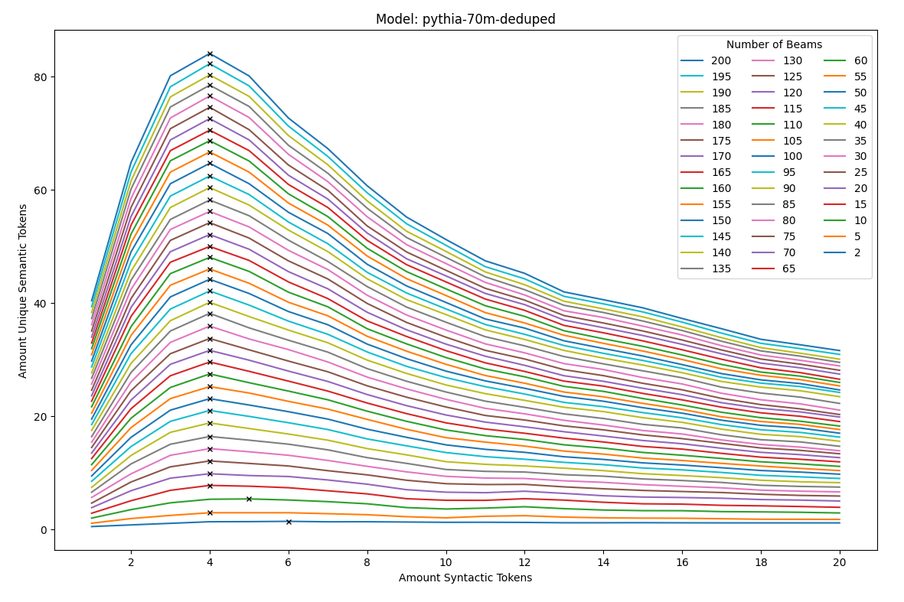
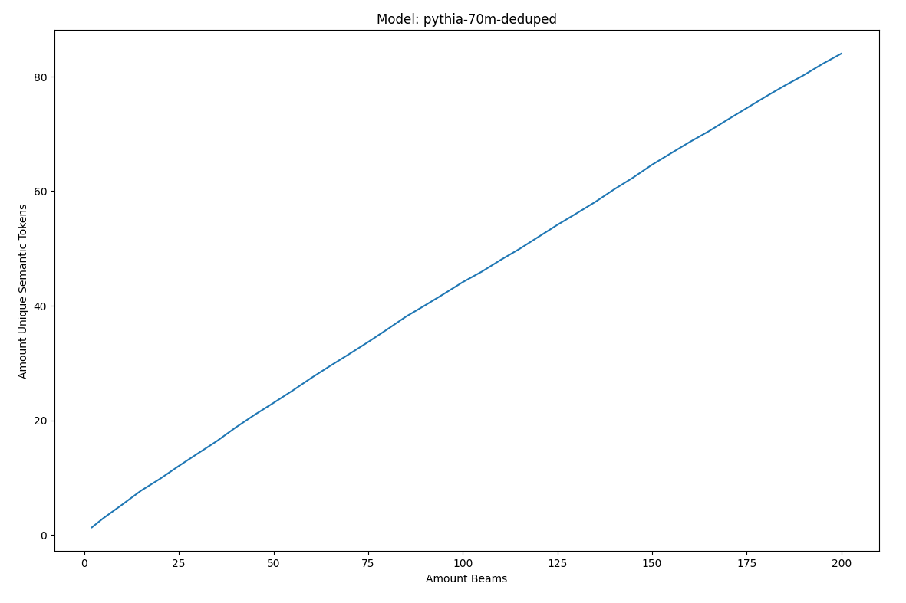

# Results
This graph shows the results for the quantity vs diversity experiment. The experiment was conducted to investigate the effect of the number of syntactic tokens for the generation of semantic tokens while also considering the amount of beams during the generation.

    

        
    

    

        
    

    

        
    

    

        
    

If we plot the beams as individual lines at `amount_syntactic_tokens = 1` in a 2d graph and mark the highest values with x's, we get the following result:

    

We can see, that 4 syntactic tokens seem to be the best choice for the generation. The linearity of growth of semantic tokens is clearly visualized when we gather all the amount of semantic tokens at the best amount of syntactic tokens. If we now plot the amount of semantic tokens (y-axis) against the amount of beams (x-axis), we get the following graph:

    

